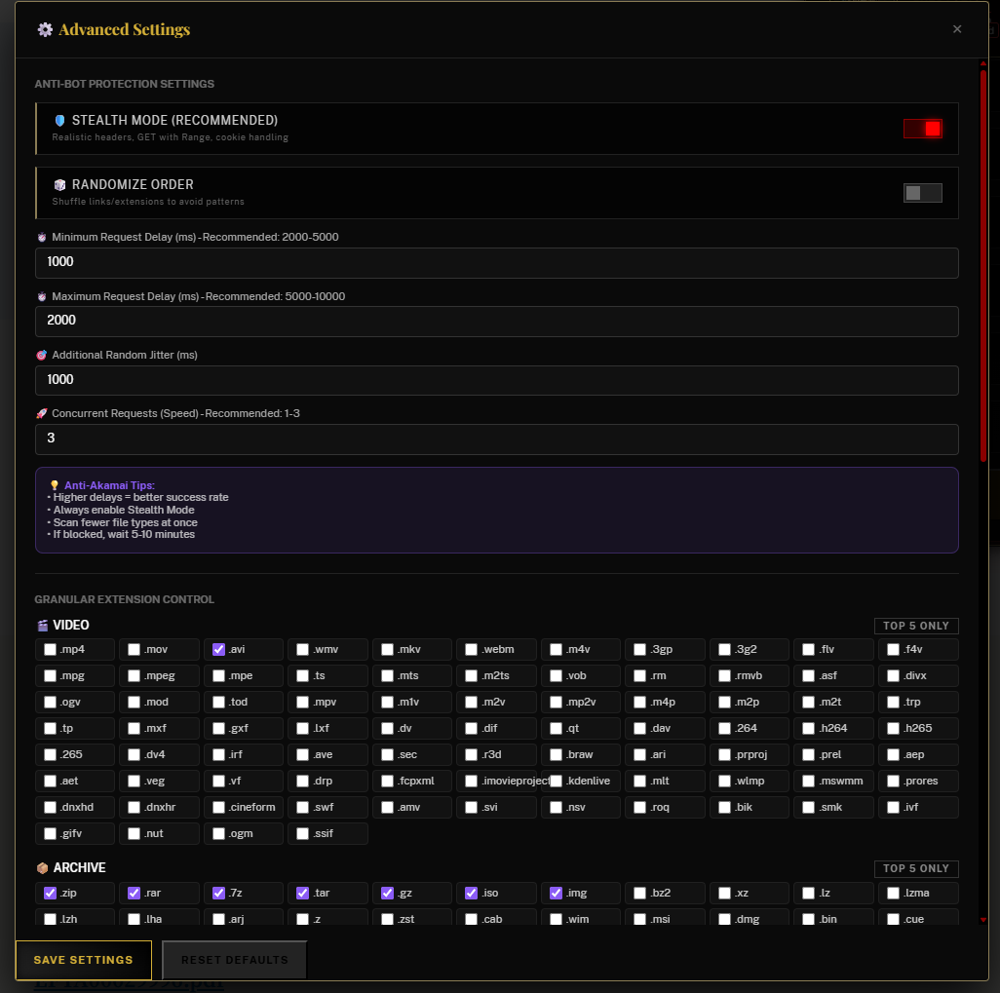
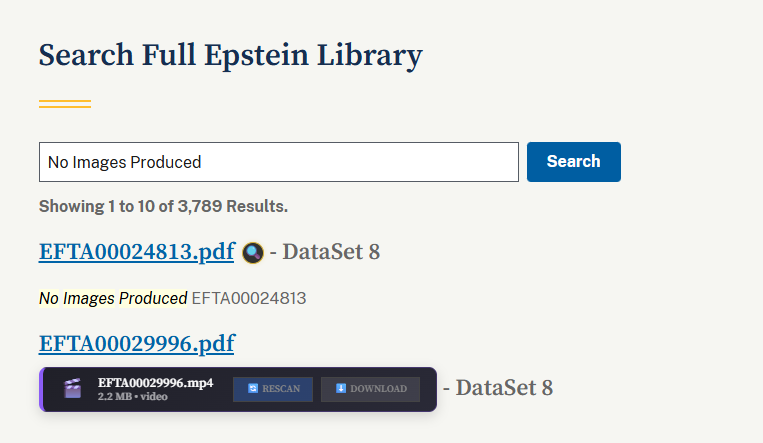

# 🎯 Epstein File Sniper
**Precision Discovery & Media Extraction**

[Install Script](https://raw.githubusercontent.com/AmericanCitizen/E_video_helper/main/doj_video_player.user.js) • [Documentation](#-user-guide) • [Settings](#-advanced-settings)

## 🚀 Key Features

- **🎬 Cinematic UI**: Premium Gold/Red/Black "Thriller" aesthetic with glassmorphism and Playfair Display typography.
- **⚡ 3x Parallelism**: Concurrent worker pool scans up to 3 links simultaneously (6x faster than standard methods).
- **🛡️ Stealth Guard**: Adaptive delays (300ms-800ms) and randomized jitter to bypass CDN rate limits.
- **🔭 Sweep Mode**: "Patrol" mode for automated multi-page crawling and background scanning.
- **🔄 Auto-Resume**: Smartly reloads and resumes scanning when rate limits (429/403) are hit.
- **🔄 Deep Format Cycles**: Cycle through alternate extensions (MOV, AVI, MP4, etc.) for every record.
- **📡 Live Update Check**: Silent semantic version comparison fetches the latest sniper tech from GitHub (plus manual check button).
- **🔞 Silent Age-Verify**: Autosolves DOJ "Over 18" checks in the background without popups.

---

## 📸 Interface Preview

  <table style="width: 100%; border-collapse: collapse; border: none;">
    <tr>
      <td align="center" style="padding: 10px; border: none;">
        <strong>Cinematic Sniper UI</strong> 
        
      </td>
      <td align="center" style="padding: 10px; border: none;">
        <strong>Precision Parameters</strong> 
        
      </td>
    </tr>
    <tr>
      <td align="center" style="padding: 10px; border: none;" colspan="2">
        <strong>Individual Target Search</strong> 
        
      </td>
    </tr>
  </table>

---

## 📖 User Guide

### 🛠️ Quick Start
1. Install [Tampermonkey](https://www.tampermonkey.net/).
2. Click **[Install Epstein File Sniper](https://raw.githubusercontent.com/AmericanCitizen/E_video_helper/main/doj_video_player.user.js)**.
3. Navigate to the DOJ Epstein records page.
4. The Cinematic control panel will manifest automatically.

- **🎮 Interface & Controls**
- **🔍 Individual Target Search**: Manually input/verify specific record IDs or links that aren't yet in your local database. Allows for immediate scanning, cycles, or direct extraction.
- **🎯 Take Shot (Scan)**: Smart Scan that skips previously resolved filenames.
- **🔄 Force Rescan (All)**: Resets the entire page cache for a total re-scan.
- **🔄 Deep Scan (Single)**: Cycle through all extensions for a specific file record.
- **🔭 Sweep Mode**: Auto-navigate through pages until the operation is complete.
- **📤 Extract All**: Batch download all verified files.
- **🔄 Update Check**: Header button to manually check for script updates.
- **⚙️ Gear Icon**: Access advanced timing, concurrency, and type-filtering.

### 📊 Scanning States
- **Pending**: Targeted for verification.
- **Found**: Verified and ready for extraction.
- **Secured**: Successfully saved to local storage.
- **Failed**: No media artifacts discovered.

---

## ⚙️ Configurable Features

The Sniper's behavior can be tuned via the **System Settings (⚙️)** or by editing the `DEFAULT_CONFIG` in the source code.

### 🛠️ Hardware & Network Tuning
- **🚀 Max Parallelism**: Set the number of concurrent connections (1-5). Higher is faster but increases risk of CDN blocks.
- **⏳ Sniper Timing (Delay)**: Adjust the minimum and maximum delay between requests to mimic human behavior.
- **📦 Batch Size**: Control how many files are downloaded at once during a "Batch Extract" (Default: 100).
- **📡 Auto-Crawl Delay**: Set how long to wait after a page load before the next automated sweep begins.

### 🎯 Extraction Targets
- **File Categories**: Enable or disable entire categories (Video, Archive, Image, Audio, Document, Forensic).
- **Extension Filtering**: Drill down further in the settings to enable/disable specific file extensions (e.g., enable `.mov` only).

---

## 🎯 Optimization Strategy: The Sniper Method

To maximize efficiency and minimize detection while scanning a massive database like the DOJ's, follow this tiered strategy:

### 1️⃣ Phase 1: High-Value Targeted Strike
Enable only the most common high-value video extensions (e.g., **.mp4**, **.mov**, **.avi**) and run a full **Sweep Mode** across all pages. This identifies 80% of targets with minimal overhead.

### 2️⃣ Phase 2: Systematic Cleanup
Enable broader categories like **Audio** or **Images** one by one. Run the scan again. Because the Sniper skips "Secured" or previously scanned "Failed" records (unless force-rescanned), this pass will be much faster.

### 3️⃣ Phase 3: Total Saturation (Deep Cycles)
Once the "Pending" list is small enough, enable **all** categories and extensions. Use **Force Rescan** on specific pages that seem likely to contain evidence to run a "Total Blitz" on those records.

> [!TIP]
> Use **Sweep Mode** for long-running operations. If you hit a rate limit, the Sniper will pause and auto-resume once the cooldown expires.

---

## 🔍 Technical Details
The Sniper performs high-speed **HEAD requests** to check file headers without downloading the full file, optimizing bandwidth on DOJ's Akamai CDN.

> "It seems all of DOJ's releases are indexed as PDF files, even videos. For example, EFTA01197320.pdf is actually a video file..." - [Original Discovery](https://www.reddit.com/r/Epstein/comments/1qt818t/guide_to_finding_videos_on_the_dojs_website/)

---

### 🔍 Expanded Forensic Support
The Sniper now supports a wide range of specialized forensic formats, including:
- **Mobile Backups**: *iPhone/iTunes* (.mbdb, .mbdx, .ips), *Android* (.ab, .backup).
- **Forensic Containers**: *EnCase* (.L01), *XRY* (.xry), *Cellebrite* (.ufd), *Raw Splits* (.001, .002).
- **Encrypted Volumes**: *TrueCrypt/VeraCrypt* (.tc, .hc, .vc).
- **Databases**: *SQLite* (.db-wal, .db-shm), *Access* (.mdb, .accdb).

---

## ⚖️ Disclaimer
This script is for research and archival purposes only. Use responsibly and in accordance with applicable laws and website terms of service.
